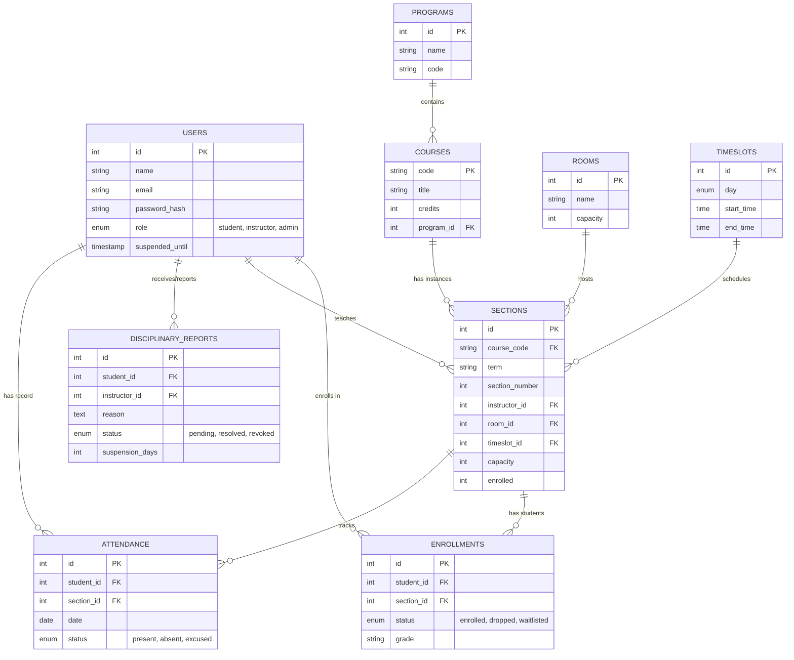
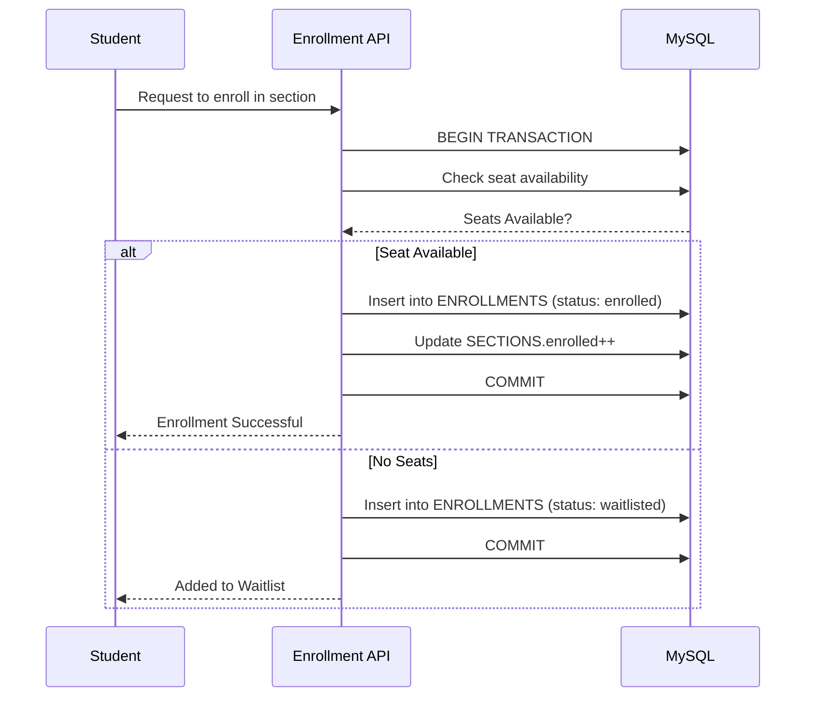

# 📘 University Course Registration & Timetabling System

A full-stack web application for managing university academic processes, including **course registration**, **timetabling**, **attendance tracking**, **grading**, and **disciplinary actions**.  
Designed with **transactional safety**, **role-based access control**, and **real-time seat availability**.

---

## 🚀 Features

### 👨‍🎓 Students

- View available courses & sections  
- Register for sections with:
  - Real-time seat availability
  - Timetable clash detection  
- View personal timetable  
- View grades  
- View attendance percentage  
- Blocked access when suspended  

### 👨‍🏫 Instructors

- Manage assigned sections  
- Create sections (time, room, capacity)  
- View enrolled students  
- Enter grades  
- Mark attendance (`Present` / `Absent` / `Excused`)  
- Report disciplinary issues  

### 🛡️ Admins

- Dashboard with system-wide analytics  
- Manage programs, courses, sections  
- Manage users (students, instructors)  
- Review disciplinary reports  
- Suspend / revoke suspension  
- Override enrollment capacity  

---

## 🏛️ System Logic

The system follows a strict academic workflow:

1. Admin creates **Program** & **Course**  
2. Instructor creates **Section** (time, room, seat limit)  
3. Student registers for a section  
4. Transaction safely updates seat count (with deadlock handling)  
5. Student gets timetable, grades, and attendance visibility  

---

## 🔐 Role-Based Access Control (RBAC)

| Role       | Permissions                                                |
|-----------|-------------------------------------------------------------|
| **Admin**     | Full control of system & academic entities               |
| **Instructor**| Manages sections, attendance, grades                     |
| **Student**   | Registers for sections, views timetable, grades, attendance |

---

## 🛠️ Tech Stack

### Frontend
- [Next.js](https://nextjs.org/) (React framework)  
- Tailwind CSS  
- Lucide React (Icons)  

### Backend
- Next.js API Routes (Serverless functions)  
- TypeScript  
- [NextAuth.js](https://next-auth.js.org/) (Credentials provider)  

### Database
- MySQL (relational database)  

### Containerization & Deployment
- Docker & Docker Compose  
- Ready for deployment to platforms like Vercel with a managed MySQL database  

---

## 📋 Database Schema (ER Diagram)



---

## 📌 Use Case Diagram

```mermaid
usecaseDiagram
    actor Admin
    actor Instructor
    actor Student

    Admin --> (Manage Users)
    Admin --> (Create Program)
    Admin --> (Create Course)
    Admin --> (Manage Sections)
    Admin --> (View System Analytics)
    Admin --> (Handle Disciplinary Actions)

    Instructor --> (Create Section)
    Instructor --> (Update Section Capacity)
    Instructor --> (View Enrolled Students)
    Instructor --> (Enter Grades)
    Instructor --> (Mark Attendance)
    Instructor --> (Report Disciplinary Issue)

    Student --> (View Courses & Sections)
    Student --> (Register for Section)
    Student --> (View Timetable)
    Student --> (View Grades)
    Student --> (View Attendance)
```

---

## 🔄 Flowchart: Main Logic (Admin → Instructor → Student)

```mermaid
flowchart TD
    A[Start] --> B[Admin Creates Program]
    B --> C[Admin Creates Course]
    C --> D[Instructor Logs In]
    D --> E[Instructor Creates Section<br>(Room, Time, Capacity)]
    E --> F[Section Published]
    F --> G[Student Logs In]
    G --> H[Student Views Available Sections]

    H --> I{Seat Available?}
    I -->|Yes| J[Check Timetable Clash]
    I -->|No| W[Waitlist Student]

    J --> K{Clash?}
    K -->|No| L[Enroll Student Transaction]
    K -->|Yes| M[Show Conflict Error]

    L --> N[Update Seat Count Atomically]
    N --> O[Create Enrollment Record]
    O --> P[Student Views Timetable]

    W --> P
    M --> H
```

---

## 🔁 Sequence Diagram: Transactional Enrollment



---

## 🗂️ Project Structure

```text
university-system/
│── src/
│   ├── app/
│   ├── components/
│   ├── api/
│   └── lib/
│── scripts/
│── prisma/ or schema.sql
│── docker-compose.yml
│── README.md
```

---

## ⚙️ Setup Instructions

### Prerequisites

- Node.js (v18+)
- Docker & Docker Compose
- MySQL client (optional, for manual DB inspection)

### 1️⃣ Clone the Repository

```bash
git clone <repository-url>
cd university-system
```

### 2️⃣ Install Dependencies

```bash
npm install
```

### 3️⃣ Environment Configuration

Create a `.env` file in the root directory:

```env
DB_HOST=localhost
DB_USER=university_user
DB_PASSWORD=university_password
DB_NAME=university_db
NEXTAUTH_SECRET=your_super_secret_key
NEXTAUTH_URL=http://localhost:3000
```

### 4️⃣ Start MySQL with Docker

```bash
docker-compose up -d
```

### 5️⃣ Initialize Database Schema

```bash
npx ts-node scripts/init_db.ts
npx ts-node scripts/update_schema.ts
npx ts-node scripts/update_schema_revocation.ts
npx ts-node scripts/update_schema_attendance.ts
```

### 6️⃣ Start the Development Server

```bash
npm run dev
```

Open: <http://localhost:3000>

---

## 🔑 Default Logins

| Role       | Email                    | Password      |
|-----------|--------------------------|---------------|
| Admin     | admin@university.com     | admin123      |
| Instructor| instructor@university.com| password123   |
| Student   | student@university.com   | password123   |

---

## 🧪 Testing & Verification

Use the `scripts/` directory to simulate and verify:

- Seat limit behavior  
- Enrollment deadlocks  
- Waitlist movement  
- Disciplinary checks  
- Attendance updates  

Additional browser-based verification steps can be documented in `walkthrough.md`.

---

## 📄 License

This project is open-source and available under the **MIT License**.

---

## ☁️ Cloud Deployment (Vercel)

When deploying to Vercel, you must use a **cloud database** (e.g., Aiven, PlanetScale, etc.) instead of a local one.

Configure these environment variables in Vercel:

- `DB_HOST`
- `DB_USER`
- `DB_PASSWORD`
- `DB_NAME`
- `DB_PORT`
- `DB_SSL` (set to `"true"`)

Ensure your cloud MySQL instance allows external connections from Vercel and uses SSL if required.
