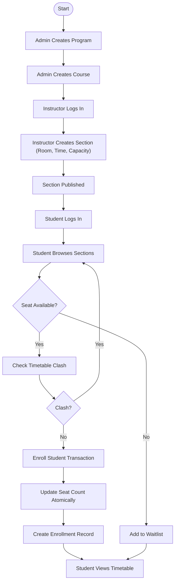
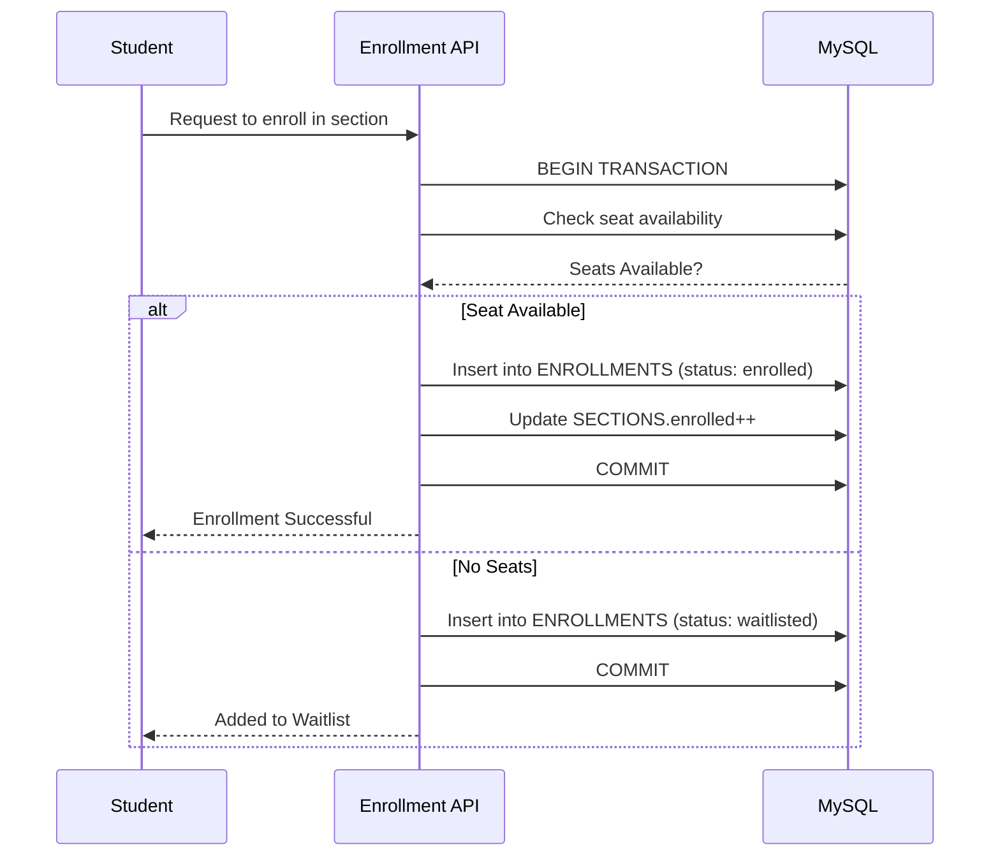

# 📘 University Course Registration & Timetabling System

A modern, full-stack academic management system supporting **course registration**, **timetabling**, **attendance tracking**, **grading**, and **disciplinary workflows**.  
Built for **transactional safety**, **role-based access**, **real-time section availability**, and seamless academic operations.

---

# 🚀 Features Overview

## 👨‍🎓 Student Portal

- 🔍 View all available courses & sections  
- 📝 Register with:
  - Real-time seat validation  
  - Timetable clash detection  
- 📅 View personal weekly timetable  
- 📊 View grades  
- 📈 Attendance percentage tracking  
- 🚫 Access blocked automatically when suspended  

---

## 👨‍🏫 Instructor Portal

- 📚 Manage assigned sections  
- ➕ Create sections (room, time, capacity)  
- 👥 View enrolled students  
- 📝 Enter grades  
- ✔️ Mark attendance (`Present`, `Absent`, `Excused`)  
- ⚠️ Report disciplinary issues  

---

## 🛡️ Admin Portal

- 📊 Dashboard with system-wide analytics  
- 🧩 Manage programs, courses, sections  
- 👥 Manage all users (students, instructors)  
- ⚖️ Review disciplinary reports  
- 🔒 Suspend or reinstate students  
- 📈 Override enrollment capacity  

---

# 🏛️ Academic Workflow

1️⃣ **Admin** creates program & course  
2️⃣ **Instructor** schedules sections  
3️⃣ **Student** registers for a section  
4️⃣ System performs:
- Transactional seat update  
- Timetable conflict check  
- Optional waitlisting  
5️⃣ Student receives:
- Timetable  
- Grades  
- Attendance overview  

---

# 🔐 Role-Based Access Control (RBAC)

| 🧑 Role        | 🎯 Permissions                                                |
|---------------|----------------------------------------------------------------|
| **Admin**     | Full control of system & academic entities                     |
| **Instructor**| Manages sections, attendance, grades                           |
| **Student**   | Registers for sections, views timetable, grades, attendance    |

---

# 🗄️ Database Schema (ER Diagram)


---

# 🎭 Use Case Representation (Flowchart Version)

```mermaid
flowchart TB
    %% Actors
    Admin([👑 Admin])
    Instructor([👨‍🏫 Instructor])
    Student([👨‍🎓 Student])

    %% Admin use cases
    Admin --> AU1[Manage Users]
    Admin --> AU2[Create Program]
    Admin --> AU3[Create Course]
    Admin --> AU4[Manage Sections]
    Admin --> AU5[View System Analytics]
    Admin --> AU6[Handle Disciplinary Actions]

    %% Instructor use cases
    Instructor --> IU1[Create Section]
    Instructor --> IU2[Update Section Capacity]
    Instructor --> IU3[View Enrolled Students]
    Instructor --> IU4[Enter Grades]
    Instructor --> IU5[Mark Attendance]
    Instructor --> IU6[Report Disciplinary Issue]

    %% Student use cases
    Student --> SU1[View Courses & Sections]
    Student --> SU2[Register for Section]
    Student --> SU3[View Timetable]
    Student --> SU4[View Grades]
    Student --> SU5[View Attendance]
```



---

# 🔄 Main Workflow (Admin → Instructor → Student)



---

# 🔁 Transactional Enrollment (Sequence Diagram)



---

# 📁 Project Structure

```text
university-system/
│── src/
│   ├── app/
│   ├── components/
│   ├── api/
│   └── lib/
│── scripts/
│── prisma/ or schema.sql
│── docker-compose.yml
│── README.md
```

---

# ⚙️ Setup Instructions

## 🧩 Prerequisites

- Node.js (v18+)  
- Docker & Docker Compose  
- MySQL client (optional, for manual DB inspection)

## 📥 Install Dependencies

```bash
npm install
```

## ⚙️ Environment Configuration

Create a `.env` file in the project root:

```env
DB_HOST=localhost
DB_USER=university_user
DB_PASSWORD=university_password
DB_NAME=university_db
NEXTAUTH_SECRET=your_super_secret_key
NEXTAUTH_URL=http://localhost:3000
```

## 🐬 Start MySQL with Docker

```bash
docker-compose up -d
```

## 🏗️ Initialize Database Schema

```bash
npx ts-node scripts/init_db.ts
npx ts-node scripts/update_schema.ts
npx ts-node scripts/update_schema_revocation.ts
npx ts-node scripts/update_schema_attendance.ts
```

## ▶️ Start the Development Server

```bash
npm run dev
```

Open: **http://localhost:3000**

---

# 🔑 Default Logins

| Role         | Email                      | Password    |
|--------------|----------------------------|-------------|
| 👑 Admin      | admin@university.com       | admin123    |
| 👨‍🏫 Instructor | instructor@university.com | password123 |
| 👨‍🎓 Student   | student@university.com     | password123 |

---

# 🧪 Testing & Verification

Use the `scripts/` directory to simulate and verify:

- ✅ Seat limit enforcement  
- 🔁 Enrollment deadlocks (transaction handling)  
- 📥 Waitlist behavior and movement  
- ⚖️ Disciplinary actions & suspensions  
- 📝 Attendance updates and calculations  

Additional browser-based walkthroughs can be documented in `walkthrough.md`.

---

# ☁️ Cloud Deployment (Vercel)

For deployment on Vercel, use a **cloud-hosted MySQL database** (e.g., Aiven, PlanetScale, Neon).

Configure these environment variables in Vercel:

- `DB_HOST`  
- `DB_USER`  
- `DB_PASSWORD`  
- `DB_NAME`  
- `DB_PORT`  
- `DB_SSL=true`  

Ensure your database accepts secure external connections from Vercel.

---

# 📄 License

This project is open-source and available under the **MIT License**.
